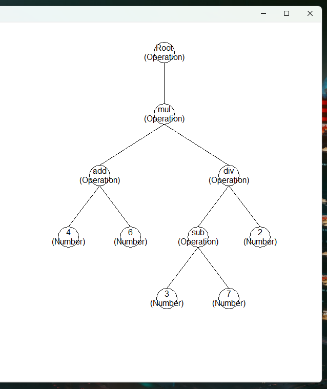
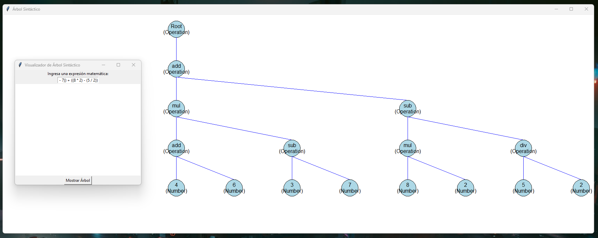
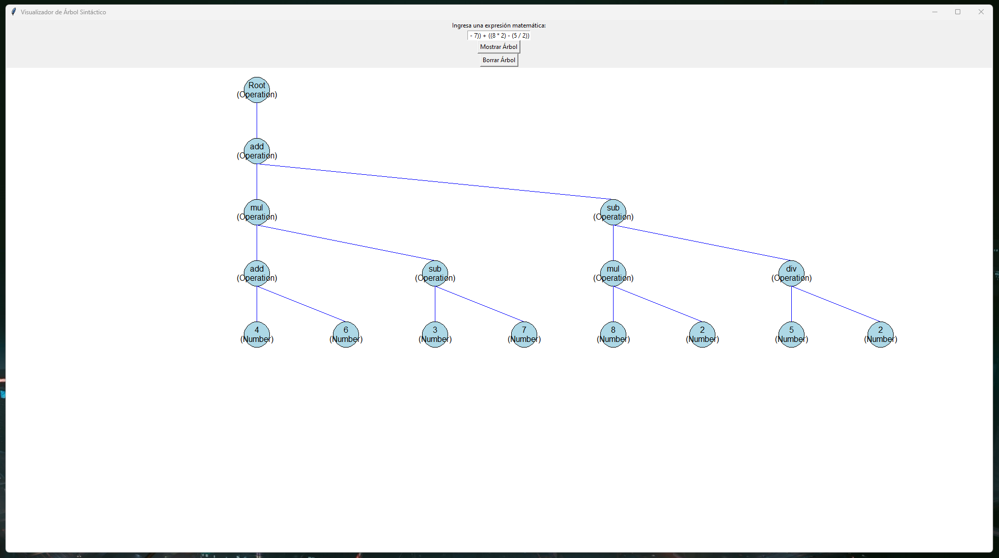
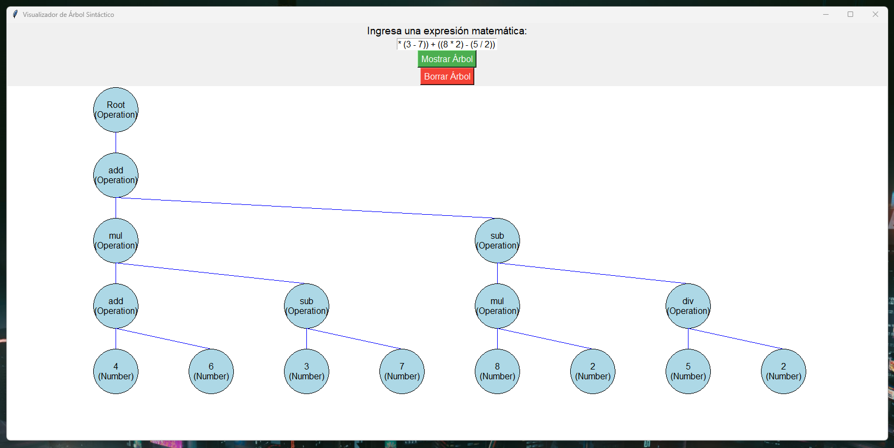

# Árbol sintáctico abstracto con Lark y Tkinter / AST with Lark and Tkinter
(ESP)
Este proyecto muestra una representación gráfica (Tkinter) de un árbol sintáctico abstracto generado a partir de expresiones matemáticas definidas en la gramatica (Lark).

(ENG)
This project shows a graphic representation (Tkinter) of a AST generated using the mathematic expresions defined on the grammar (Lark).

## Descripción / Description
(ESP)
La aplicación permite ingresar expresiones matemáticas simples y visualizar su árbol sintáctico utilizando nodos y conexiones en una interfaz gráfica.

(ENG)
The application allows users to input simple mathematical expressions and visualize their syntax tree using nodes and connections in a graphical interface.

## Cómo usar / How to use
(ESP)
1. Clona o descarga este repositorio.
2. Asegúrate de tener instalados Python y las siguientes librerías: [tkinter](https://docs.python.org/es/3/library/tkinter.html),
   [lark-parser](https://github.com/lark-parser/lark).
4. Ejecuta el script `tree_visualizer.py`.
5. Ingresa una expresión matemática en la ventana y haz clic en "Mostrar Árbol" para visualizar el árbol sintáctico.

(ENG)
1. Clone or download this repository.
2. Ensure you have Python installed along with the following libraries: tkinter, lark-parser.
3. Run the script tree_visualizer.py.
4. Input a mathematical expression in the window and click "Display Tree" to visualize the syntax tree.

## Ejemplo v1 / Example v1

## Ejemplo v2 / Example v2

## Ejemplo v3 / Example v3

## Ejemplo v4 / Example v4

## Ejemplo v5 / Example v5

