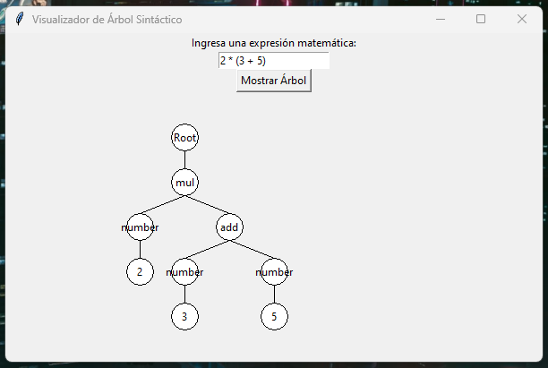

# Árbol Sintáctico en Tkinter

Este proyecto muestra una representación gráfica de un árbol sintáctico generado a partir de expresiones matemáticas utilizando Tkinter y Lark.

## Descripción / Description
 (ESP)La aplicación permite ingresar expresiones matemáticas simples y visualizar su árbol sintáctico utilizando nodos y conexiones en una interfaz gráfica.
 (ENG)The application allows users to input simple mathematical expressions and visualize their syntax tree using nodes and connections in a graphical interface.

## Cómo usar / How to use
(ESP)
1. Clona o descarga este repositorio.
2. Asegúrate de tener instalados Python y las siguientes librerías: `tkinter`, `lark-parser`.
3. Ejecuta el script `tree_visualizer.py`.
4. Ingresa una expresión matemática en la ventana y haz clic en "Mostrar Árbol" para visualizar el árbol sintáctico.

(ENG)
1. Clone or download this repository.
2. Ensure you have Python installed along with the following libraries: tkinter, lark-parser.
3. Run the script tree_visualizer.py.
4. Input a mathematical expression in the window and click "Display Tree" to visualize the syntax tree.

## Ejemplo / Example

